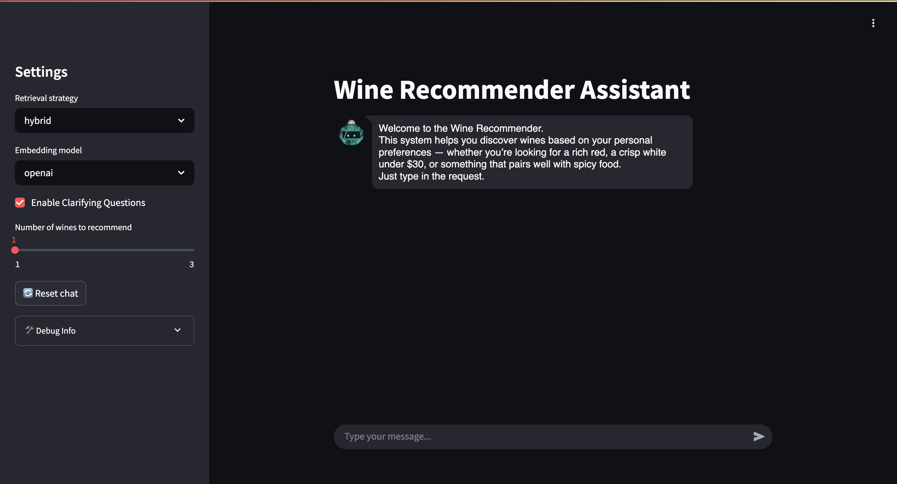

# Wine Recommendation System Based on Retrieval Augmented Generation
# This repository is a code storage for the thesis of the same name by Ivan Nikolaichenko

# Description
This repository contains the code for a wine recommendation system, that works with natural language queries.
The core concept of the system is RAG, when the LLM (GPT-4o-mini in this case) is provided with the additional context (wines in this case) to generate a more relevant response and reduce the hallucination likelihood.
The wine documents can be retrieved based on the users query, using three different methods: Naive, Hybrid, HyDE, Fusion. The user may choose any of them, as well as one of the three embedding models.
The solution is fully dockerized with a simple UI for user's convenience.
# Usage Guide
## Set Up
1. Clone this GitHub repository \
Run the following command in your terminal in the directory where you want the project located:
```bash
git clone https://github.com/frontfliip/RAG-based-Wine-Recommendation-System.git
```
2. Create the .env file \
Create a `.env` file in the project root and add your OpenAI API key as follows:
```env
OPENAI_API_KEY="YOUR_OPENAI_KEY"
```
3. Start the application \
   - Ensure Docker is installed. If it’s not, click [here](https://docs.docker.com/get-docker/) to get it.
   - Navigate to the project directory:
     ```bash
     cd RAG-based-Wine-Recommendation-System
     ```
   - Start the Docker containers:
     ```bash
     docker-compose up
     ```
   - Wait until both containers are up and running. Ensure that all downloading process are finished, it may take some time.
   - Open your browser and go to http://0.0.0.0:8501 to start interacting with the application.
4. Stop and clean up Docker containers  (once you are fifnished)
   - To stop the running containers:
     ```bash
     docker-compose down
     ```

## Inference
Once you are started, the interface will look like this:


On the left you can choose the retrieval method, the embedding model and the number of wines to recommend. You can also enable or disable the `clarifying questions`. It is the question that are meant to give more context from you for better recommendations. <br>
It is important that it is not a chat-like assistant, one query - one recommendation. However, after the recommendation is recieved, you can add the follow-up details to it, if needed. It will trigger the recommendation process to repeat.
If you want a new chat, just click `Reset chat` button. <br> For the best experience choose `Fusion` and `openai` embedding model, since this combination got the best metrics on the evaluation. And if you want to dig deeper into this project - check out the full thesis overleaf project [here](https://www.overleaf.com/read/dfppmryqcynr#4caaae).   
So, whenever you are ready, write the query and enjoy your wine!

# Folders Navigation

- `app/`: Main application code
  - `llm_setup/`: LLM prompt templates and setup scripts
  - `rag_methods/`: Retrieval-augmented generation logic and metadata matching
  - `vectorstore/`: Scripts to create and load FAISS indices for vector search
  - `main.py`: Entry point to launch the Flask app
- `data_processing/`: Data gathering and preprocessing
  - `reviews_scraping/`: Scraping scripts and raw CSV/log output for wine reviews
  - `data_processing.ipynb`: Notebook for cleaning and transforming data
  - `wine_data_final.csv`: Processed dataset ready for indexing
- `evaluation/`: Evaluation pipelines and results
  - `results_metrics/`: Directories containing evaluation metrics for various experiments
  - `evaluation.ipynb`: Notebook to run and visualize evaluation <br> **(Important that if you want to check out this notebook, download it and open locally. GitHub is facing problems with displaying the .ipynb files recently)**
  - `evaluation_configs.json` & `evaluation_configs_real.json`: Config files for experiments
  - `llm_labeled.csv` & `top_wines_journal.csv`: Labeled datasets used for evaluation
- `schemas_and_images/`: Diagram assets and UI screenshot used in documentation
- Root files:
  - `.env`: Environment variables (OpenAI API key)
  - `.gitignore`: Git ignore rules
  - `docker-compose.yaml` & `Dockerfile`: Docker configuration
  - `README.md`: This documentation
  - `requirements.txt`: Python dependencies list